**Praktikum Sistem Terdistribusi dan Terdesentralisasi Pert02**

Nama : Febiana Serao Da Cruz

NIM  : 235410032

**Proses Pada Satu Node**

Tugas :
1.	Tampilkan berbagai proses yang ada pada komputer yang anda gunakan sesuai dengan sistem operasi yang anda gunakan.

   

2. Jalankan salah satu aplikasi, perlihatkan proses yang dimunculkan oleh aplikasi tesebut. 
Yang saya jalankan yaitu notepad

    

   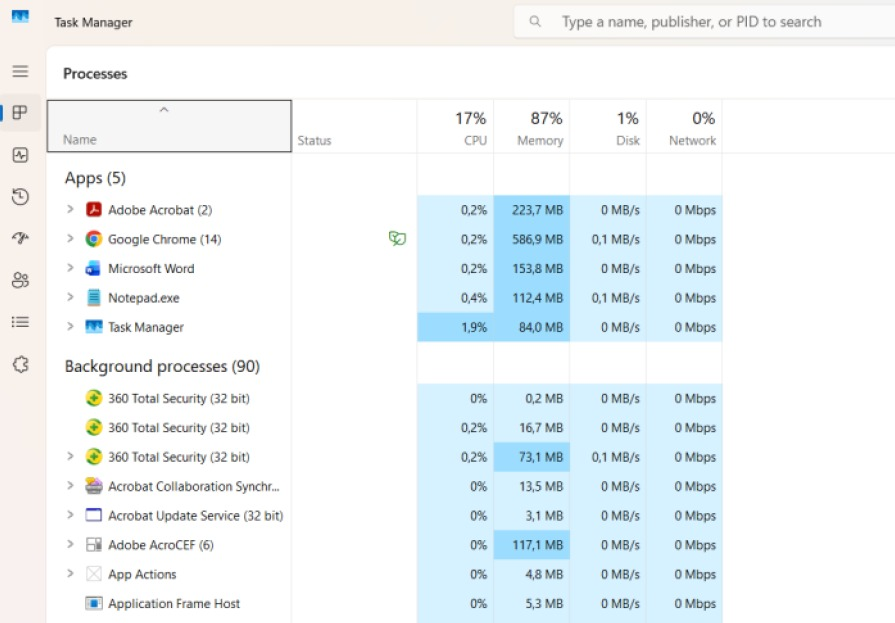

3. me-restart proses dan mematikan proses. Matikan proses yang dimunculkan oleh aplikasi yang dijalankan, jangan gunakan perintah untuk keluar dari aplikasi yang dijalankan tetapi gunakan perintah untuk mematikan proses dari aplikasi yang dijalankan.
   
   Tampilan sebelum end task
      

   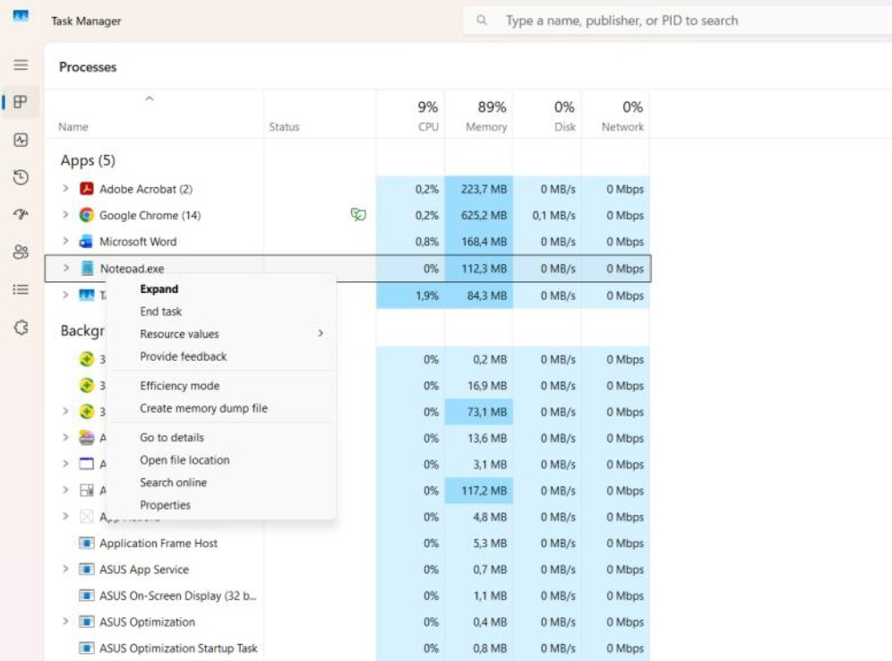
 

   Tampilan Setelah end task 
    
   

  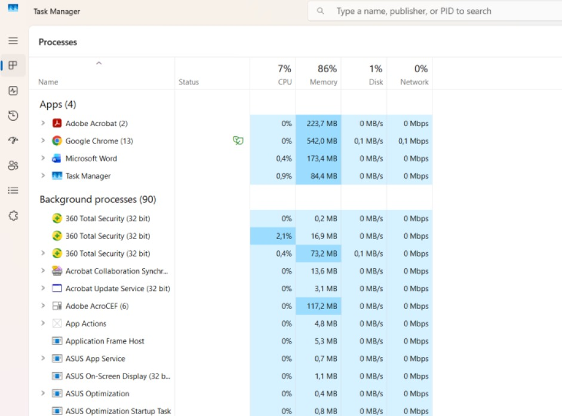

4.	Jelaskan semua hal yang anda kerjakan tersebut?
   
Jawaban :

Awalnya saya menampilkan semua proses yang berjalan di Task Manager, kemudian menjalankan aplikasi Notepad dan melihat bahwa muncul proses baru sesuai dengan aplikasi yang dijalankan. Setelah itu, saya mencoba mematikan proses tersebut dengan cara memilih aplikasi Notepad di Task Manager lalu menekan tombol End Task. Setelah proses diakhiri, aplikasi Notepad secara otomatis tertutup tanpa menggunakan tombol keluar pada aplikasi. Hal ini menunjukkan bahwa proses dapat dikendalikan langsung melalui sistem operasi.

**Komunikasi Antar Proses pada Sistem Terdistribusi**

Membuat Workspace
   

  

Tampilan pada saat membuat virtual environment
   

  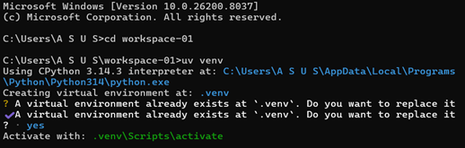

Tampilan pada saat mengaktifkan virtual environment dengan perintah .venv\Scripts\activate, sehingga environment siap digunakan dan ditandai dengan munculnya (workspace-01). Selanjutnya ditampilkan proses instalasi library strawberry-graphql menggunakan perintah uv pip install "strawberry-graphql[cli]" yang digunakan untuk membuat server GraphQL.

  

  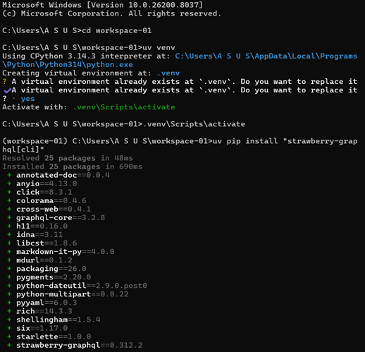

isi schema.py
   

  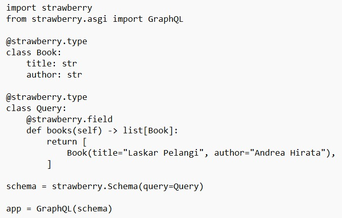

Tampilan pada saat menjalankan server GraphQL menggunakan perintah uvicorn, sehingga server dapat diakses.
   

  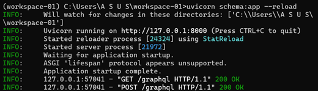

 

Tampilan setelah server berhasil dijalankan, dilakukan pengujian melalui browser dengan memasukkan query untuk mengambil data buku berupa title dan author. Query tersebut berhasil dijalankan dan menampilkan data sesuai dengan yang terdapat pada file schema.py.

   

   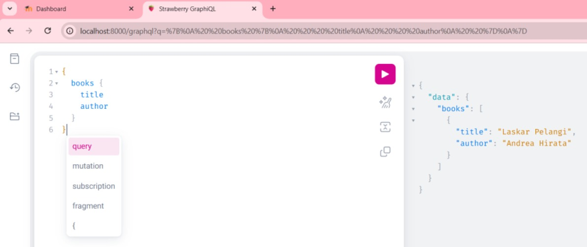
 

Tugas :

Buatlah client menggunakan bahasa pemrograman bebas. Client tersebut mengakses GraphQL server yang sudah dibuat di atas.

Jawaban :

Tampilan pada saat mengaktifkan virtual environment dengan perintah .venv\Scripts\activate, sehingga environment siap digunakan dan ditandai dengan munculnya (workspace-01). Selanjutnya ditampilkan proses pembuatan file client.py yang digunakan sebagai client untuk mengakses server GraphQL.
   

  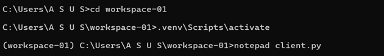

isi file client.py
  

  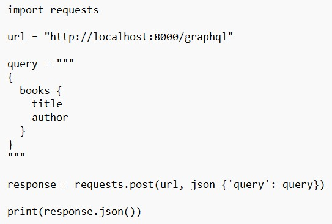

Tampilan pada saat melakukan instalasi library requests yang digunakan untuk mengirim permintaan ke server. Selanjutnya ditampilkan proses menjalankan program client untuk mengambil data dari server GraphQL.
   

  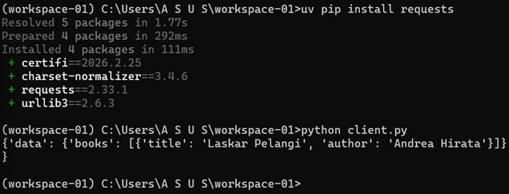

 

Penjelasan :
Program client dibuat menggunakan Python untuk mengakses server GraphQL yang telah dibuat sebelumnya. Client mengirim query untuk mengambil data buku berupa title dan author ke server. Program kemudian dijalankan dan berhasil menerima respon dari server berupa data buku yang sesuai dengan isi pada file schema.py, yaitu satu data buku "Laskar Pelangi" karya Andrea Hirata. Hal ini menunjukkan bahwa client berhasil mengakses server dan mengambil data dengan baik.
