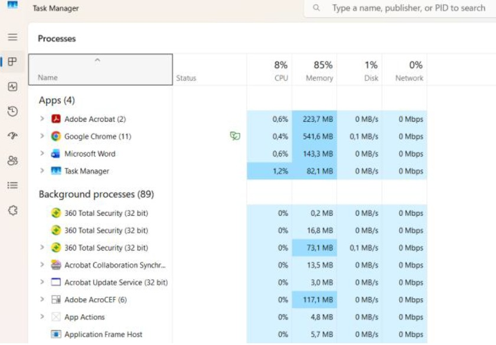

**Praktikum Sistem Terdistribusi dan Terdesentralisasi_02**

Nama : Febiana Serao Da Cruz

NIM  : 235410032

Tugas :
1.	Tampilkan berbagai proses yang ada pada komputer yang anda gunakan sesuai dengan sistem operasi yang anda gunakan.

   

  

Gambar 1: Proses pada Windows

 

3.	Jalankan salah satu aplikasi, perlihatkan proses yang dimunculkan oleh aplikasi tesebut. 
Yang saya jalankan yaitu notepad 
 

4.	Carilah petunjuk untuk: me-restart proses dan mematikan proses. Matikan proses yang dimunculkan oleh aplikasi yang anda jalankan, jangan gunakan perintah untuk keluar dari aplikasi yang anda jalankan tetapi gunakan perintah untuk mematikan proses dari aplikasi yang anda jalankan. 

 

Setelah meng end task : dengan sendrinya akan terkluar sendri notepadnya
 

4.	Jelaskan semua hal yang anda kerjakan tersebut?
Jawaban :
Awalnya saya menampilkan semua proses yang berjalan di Task Manager, kemudian menjalankan aplikasi Notepad dan melihat bahwa muncul proses baru sesuai dengan aplikasi yang dijalankan. Setelah itu, saya mencoba mematikan proses tersebut dengan cara memilih aplikasi Notepad di Task Manager lalu menekan tombol End Task. Setelah proses diakhiri, aplikasi Notepad secara otomatis tertutup tanpa menggunakan tombol keluar pada aplikasi. Hal ini menunjukkan bahwa proses dapat dikendalikan langsung melalui sistem operasi.

	Membuat Workspace
 

 

 

Penjelasan : 
Pada bagian ini terlebih dahulu dibuat file schema.py yang berfungsi sebagai server GraphQL, dimana di dalamnya didefinisikan tipe data Book yang memiliki atribut title dan author serta query untuk menampilkan data buku. Setelah itu dilakukan instalasi library strawberry-graphql menggunakan perintah uv pip install "strawberry-graphql[cli]". Selanjutnya server dijalankan menggunakan perintah uvicorn schema:app --reload sehingga server dapat berjalan dan siap digunakan.

Isi file schema.py

Penjelasan :
Setelah server berhasil dijalankan, dilakukan pengujian melalui browser dengan memasukkan query untuk mengambil data buku berupa title dan author. Query tersebut berhasil dijalankan dan menampilkan data sesuai dengan yang terdapat pada file schema.py.

Tugas :
Buatlah client menggunakan bahasa pemrograman bebas. Client tersebut mengakses GraphQL server yang sudah dibuat di atas.

Jawaban :

 

 

Penjelasan :
Program client dibuat menggunakan Python untuk mengakses server GraphQL yang telah dibuat sebelumnya. Client mengirim query untuk mengambil data buku berupa title dan author ke server. Program kemudian dijalankan dan berhasil menerima respon dari server berupa data buku yang sesuai dengan isi pada file schema.py, yaitu satu data buku "Laskar Pelangi" karya Andrea Hirata. Hal ini menunjukkan bahwa client berhasil mengakses server dan mengambil data dengan baik.
